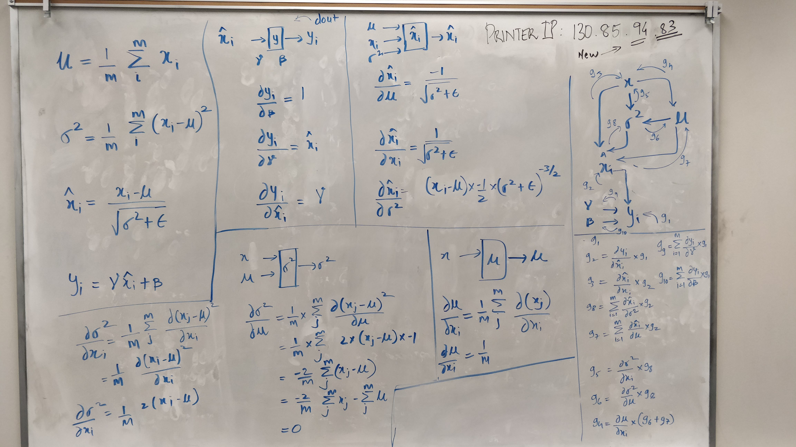

# cs321n assignment solutions

Thanks to the team of the amazing [cs231n][2] course.

I would recommend this course to anyone interested applying deep learning
for vision problems (the area in which deep learning has yielded the most
success). Originally developed by Andrej Karpathy, the course dives _deep_
into the fundamental ideas powering the various neural network algorithms.
You should have a very solid understanding of the following things if you
go through all the videos and do the assignments properly:

* Backpropogation in code
* Fluency with tensors and numpy arrays
* Training a deep learning model
* Basic skills with either PyTorch or Tensorflow
* End-to-end boilerplate framework for deep learning
* Visualizing and understanding neural networks
* Some interesting tricks and tips (useful beyond these assignments)

Expect to dedicate considerable amount of time to complete these exercises.
Also, just watching the videos won't give the confidence and understanding
that can be gotten by simply getting your hands dirty. Besides, doing these
exercises is very much a fun thing!

Akin to the importance of learning assembly language, a skilled practitioner
of deep learning must have an intuitive grasp of the fundamental blocks; and,
this course will give you just that.

## Installing dependecies

Use conda and run following command (in project root) to install the
dependencies for all assignments:

```bash
conda env create -f environment.yml
```

## My solution

Since I had already tackled the basic problems like feature extraction,
knn, softmax, and svm earlier, I mostly skipped the first assignment.
This turned out to be a patently bad idea in the hindsight. But, I somehow
managed to work through the second assignment. Following are some random
thoughts on the parts that I completed (2 and 3 assignment):

* Batch normalization exercise is the hardest in all the assignments.
* After completing batchnorm exercises on your own, go through the solution
of [others][3]
* Hyperparameter selection is hard. Instead of changing them manually and
running the training, write a script to try a bunch of combinations. Since,
the training time is rather small, you can afford to brute force the
hyperparameter selection.
* Go through the [hints][1] before tackling the second assignment
* I found that the third assignment hit the balance difficulty and fun

### Batchnorm Alt

I worked rather hard on coming up with my own version of solution for this
exercise. I couldn't understand any of the [online][4] [solutions][5], so
I wrote my own. The idea of the backpropagation is really simple:
break down a big computation into a graph of smaller computations and
then walk back from the leaf nodes to the root node while calculating
the gradient at each node. You should really understand the slides
accompanying the lecture videos to move ahead.



Each vertex in the graph (top right section) represents a sub-computation
leading to the final output (y). At each vertex we compute the gradient
with respect to its inputs (various sections describe this computation for
x_hat, y, variance, and mean). Then we walk back from y to x via each node.

```python
dx_dy = g1 * g2 * g3 + \
        g1 * g2 * g8 * g5 + \
        g1 * g2 * g8 * g6 * g4 + \
        g1 * g2 * g7 * g4

# simplifying (note that g6 is zero)
dx_dy = g * g2 * (g3 + g8 * g5 + g7 * g4)
# just insert the equations in above and do the final computation

```


[1]: https://www.reddit.com/r/cs231n/comments/443y2g/hints_for_a2/?st=j7ycdnkr&sh=a4775a0c
[2]: http://cs231n.stanford.edu/2017/
[3]: https://kratzert.github.io/2016/02/12/understanding-the-gradient-flow-through-the-batch-normalization-layer.html
[4]: https://kevinzakka.github.io/2016/09/14/batch_normalization/
[5]: http://cthorey.github.io./backpropagation/
